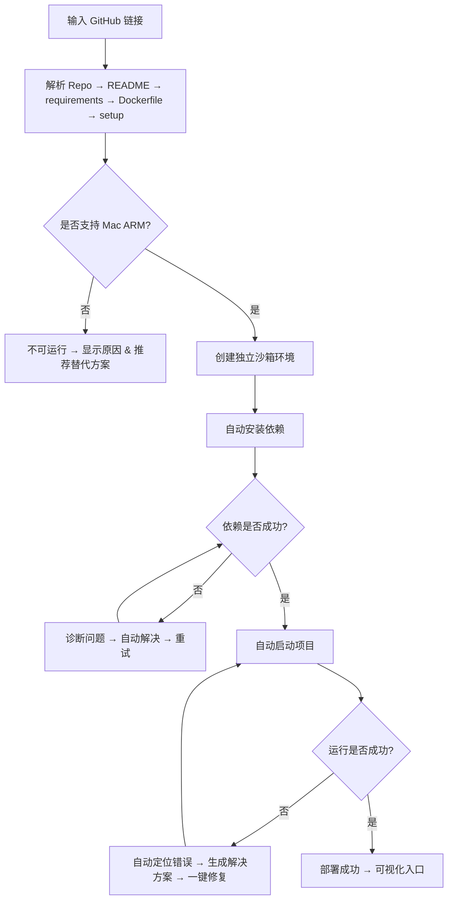
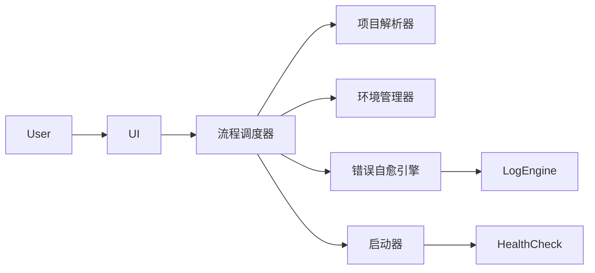

# 自动解析 GitHub 项目并一键本地部署的 Mac ARM 应用（产品方案 v2 · 加强版）

为 TRUE 团队准备 · 增强版（包含：全流程设计、风险判断、错误自愈机制、异常可视化、重试机制、自动修复路径等）

## 目录
- 产品定位 & 目标
- 目标用户
- 用户使用场景
- 产品总体流程（含自动判断与自愈）
- 核心功能详述（含错误判断+自愈）
- 智能错误可视化 & 自愈方案
- UI/UX 交互流程
- 关键技术设计
- 系统设计架构
- 权限、安全性设计
- 性能优化
- 项目分工 & 角色安排（PM → 开发 → QA）
- 风险评估与缓解策略
- 迭代计划（V1 → V2 → V3）
- 可交付结果（Output）

## 1. 产品定位 & 目标
做一个 输入 GitHub 链接 → 自动一键部署本地环境 的 Mac ARM 原生 App。

最终目标：让所有用户不再踩坑，自动解决依赖、系统兼容、GPU/CPU、环境版本等技术麻烦，只需一条链接即可完成部署。

## 2. 目标用户
- AI 工程师 / Python 工程师
- 产品经理、数据科学家
- 开源项目体验者
- 需要快速验证 GitHub 项目 Demo 的创业团队

## 3. 使用场景
- 跑开源 AI 推理项目依赖复杂
- 体验 GitHub 项目但不清楚环境、版本、CUDA、Homebrew 细节
- 公司要求快速验证一个开源 Demo
- 不确定 Mac ARM 是否兼容

## 4. 产品总体流程（含自动判断 + 自愈）

## 5. 核心功能详述（含错误判断 + 自愈）
### 5.1 自动解析 GitHub 项目
- 解析：README、requirements.txt、environment.yml、Dockerfile、package.json、setup.py、pyproject.toml
- 自动判断：OS 支持、Mac ARM 兼容性、GPU/CPU、依赖是否可安装、端口占用、Python/Node 版本
- 自愈策略：CPU 模式替代、版本升级/降级/换源、自动切换端口、创建对应虚拟环境、切换 nvm 版本

### 5.2 自动创建隔离运行环境
- 使用 venv/uv 或 Docker（ARM 兼容性检测后选择最佳方案）
- 隔离依赖，不污染系统

### 5.3 自动安装依赖（含自愈）
- 每步包含自动判断、自动修复、自动重试
- 示例自愈：换 ARM 版本、尝试 universal2 轮子、切换 pip 源、安装缺失 brew 包、记录操作

### 5.4 自动运行 & 健康检查
- 自动识别启动命令：python、uvicorn、npm、docker-compose
- 健康检查：服务启动、端口监听、错误日志、模型文件缺失
- 失败时自动修复：补全模型文件、修复配置、调整依赖版本

## 6. 智能错误可视化 & 自愈设计
- 错误分四类：环境、依赖、资源、运行时
- 可视化示例：提示缺少 Python 版本，自动创建并修复
- 支持：一键复制诊断报告、一键修复、重试按钮

## 7. UI/UX 交互
- 页面：首页、项目解析、环境准备进度、错误提示、部署成功
- 关键 UX：步骤可见，状态清晰，错误显眼

## 8. 技术方案
- 解析器：README NLP、运行命令检测、依赖检测、ARM 兼容性判断
- 环境管理器：虚拟环境创建、版本切换、依赖安装策略
- 错误引擎：日志匹配、修复策略生成、自动执行安全操作
- 日志引擎：全流程可回放与导出

## 9. 系统架构

## 10. 权限与安全
- 沙盒化运行，限制危险命令
- 最小化读取权限

## 11. 性能优化
- 并行安装依赖、缓存 wheels 和 brew 包、快速重试

## 12. 项目人员安排
- PM：产品、需求、流程
- 前端：UI，Electron 或 SwiftUI
- 后端：解析器、自愈引擎、环境管理器、Runner
- QA：场景与异常测试

## 13. 风险评估 & 缓解
- 依赖不兼容：高，版本 fallback 与自愈
- ARM 不兼容项目较多：中，提供替代分支与 CPU 模式
- 解析出错：中，NLP fallback 与多文件检测
- 用户权限不足：低，自动请求权限

## 14. 迭代计划
- V1：自动解析、安装依赖、自动运行、错误可视化
- V2：自愈引擎、依赖版本自动调整、模型自动下载
- V3：插件系统、团队共享、云端运行分析

## 15. 可交付物
- 完整 PRD 文档（本文件）
- UI 原型图
- 技术设计文档
- 版本规划文档

