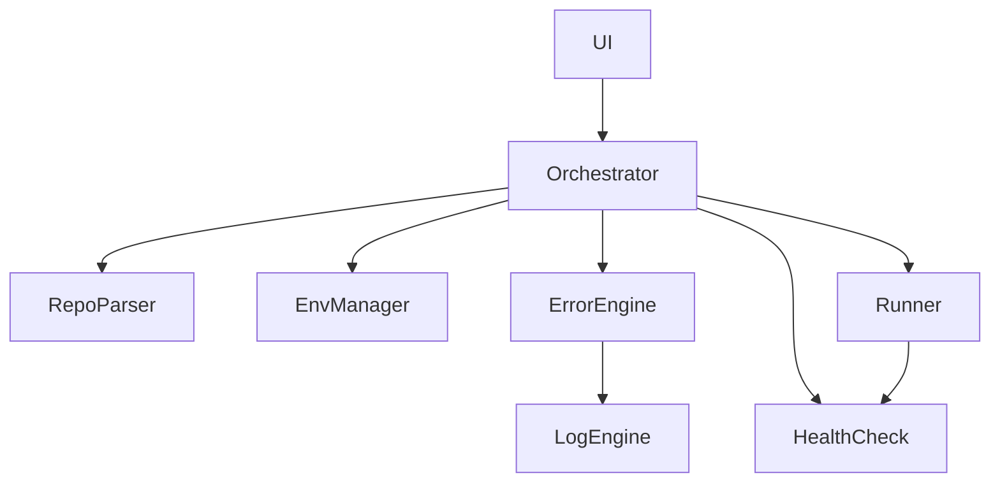

# 系统架构与数据流

## 组件与关系


## JSON Schema 概览
```json
{
  "project": {
    "name": "string",
    "language": "python|node|docker|mixed",
    "python_required": "string|null",
    "node_required": "string|null",
    "gpu_required": false,
    "arm_supported": true,
    "dependencies": ["string"],
    "start_commands": ["string"]
  },
  "plan": {
    "env_type": "venv|uv|docker",
    "install_steps": ["string"],
    "fixups": ["string"]
  },
  "diagnostics": [
    {"category": "env|dep|resource|runtime", "message": "string", "suggestion": "string"}
  ]
}
```

