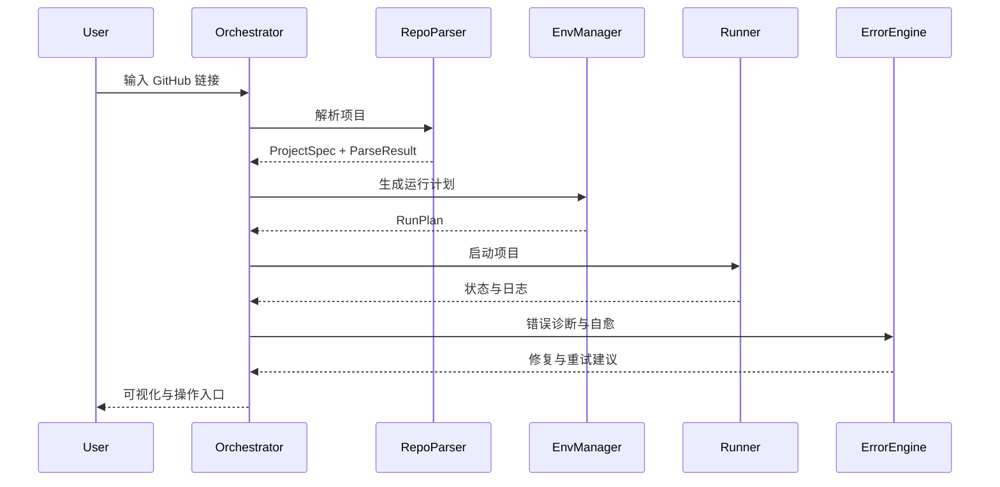

# 技术设计文档（Mac ARM 自动解析与一键部署）

## 目标
在本地以沙盒化方式自动解析 GitHub 项目，选择合适环境，完成依赖安装与启动，并提供错误自愈与可视化。

## 模块划分
- Orchestrator：流程编排与状态机
- RepoParser：解析 README、requirements、Dockerfile、package.json、setup.py、pyproject.toml
- EnvManager：虚拟环境选择、版本管理策略、安装执行计划
- ErrorEngine：错误分类、诊断、修复策略生成与执行
- Runner：启动命令识别与运行计划生成
- HealthCheck：端口与服务探测、日志校验
- LogEngine：结构化事件与日志汇总导出

## 数据模型
- ProjectSpec：项目特征（语言、版本需求、启动命令、依赖列表、GPU/CPU 需求、ARM 兼容性）
- ParseResult：解析产物（文件概览、发现的问题与建议）
- RunPlan：运行计划（环境类型、安装顺序、启动方式）
- ErrorDiagnosis：错误类别、匹配规则、修复步骤与重试策略

## 关键算法与策略
- 兼容性判定：基于文件与关键词的启发式规则集合
- 自愈策略优先级：安全、可回滚、影响最小
- 版本选择：优先满足显式约束，其次选择 ARM 可用版本与通用轮子
- 健康检查：端口占用检测、进程存活、关键日志片段匹配

## 安全与权限
- 限制执行范围与命令白名单
- 所有安装与写操作在隔离环境内
- 最小权限原则，敏感操作需交互确认

## 性能优化
- 解析与检测并发执行
- 缓存下载与构建产物
- 指数退避重试与快速失败路径

## 交互契约
- CLI 与 UI 共享统一 JSON Schema 输出
- 所有步骤产生结构化事件，供 UI 渲染进度与错误面板

## Mermaid 图

